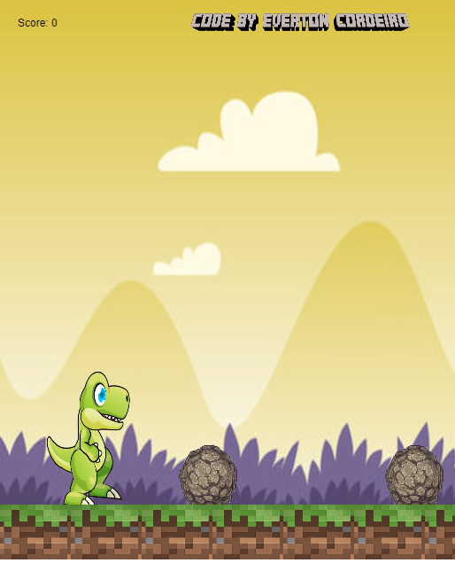

# Dino Runner

Um jogo simples em que o jogador controla um dinossauro que precisa evitar obstáculos no caminho, pulando sobre as pedras.

## Funcionalidades

- **Movimentação do Dino:** O dino se move automaticamente e pode pular para evitar obstáculos.
- **Obstáculos:** Pedras surgem no caminho em intervalos aleatórios.
- **Animações:** O dino possui animações para andar, correr, pular e morrer.
- **Sistema de Pontuação:** O placar é exibido no canto superior da tela.

## Controles

- **Computador:**
  - Pressione a barra de espaço ou a seta para cima para fazer o dinossauro pular.

- **Dispositivos Móveis:**
  - Toque na tela para fazer o dinossauro pular.

## Objetivo

O objetivo do jogo é evitar as pedras que aparecem no caminho. Se o dinossauro colidir com uma pedra, ele morre, e o jogo termina.

## Imagem

Aqui está uma imagem representativa do jogo em ação:

